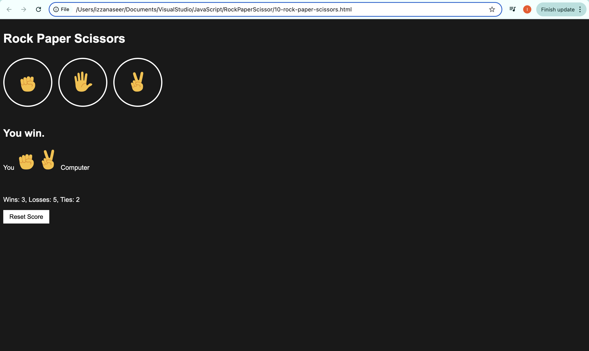

# Rock Paper Scissors Game ✊✋✌️

A simple and interactive Rock Paper Scissors game built with **HTML**, **CSS**, and **JavaScript**. The game keeps track of your wins, losses, and ties using your browser's `localStorage` so your score is preserved even if you refresh the page.

---

## Features

- 🎮 Player choose between Rock, Paper, or Scissors by clicking the buttons.

- 🤖 The computer picks a random move.

- ✅ The result is displayed instantly.

- 🧠 Keeps track of wins, losses, and ties.

- 🔄 Includes a **Reset Score** button to clear the stats.

- 🖼️ Uses emoji images for visual feedback.

- 💾 Saves game score in `localStorage`.

---

## Tech Stack
- HTML5
- CSS3
- JavaScript (ES6)
- Browser Local Storage

---

## Getting Started

1. Clone the repository:
   ```bash
   git clone https://github.com/izzanaseer/rock-paper-scissors.git
   
2. Open the game in your browser by clicking on the file:

   Click on the file `10-rock-paper-scissors.html` inside the project structure to open it in browser.

4. Play the game and have fun! 🎉

---

## Project Structure

- `10-rock-paper-scissors.html` — Main HTML structure for the Game
- `style folder` — All styling, themes, layout, and button designs
- `script folder` — Core game logic, keyboard control, scoring, and dynamic rendering
- `README.md` — Project documentation, setup instructions, and feature overview

---

## 📸 UI Preview Screenshot



---

## License

This project is licensed under the MIT License.  
It allows free use, modification, and distribution with credit to the original author.

---

## Contributions

Pull requests, issues, and feature suggestions are welcome!  
Feel free to fork the repository and contribute to make it even better.
